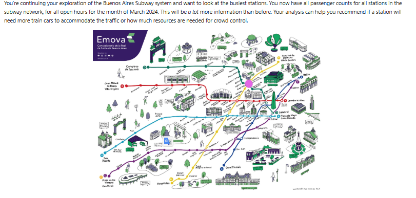

# Buenos Aires Subway Analysis 🚇

Analysis of passenger traffic in the Buenos Aires subway system using Python, Pandas and Matplotlib.

## Map 🗺️

## Overview
This project analyzes passenger traffic data from the Buenos Aires subway system for the month of March 2024. The goal is to identify the busiest stations and peak hours to help transportation planners allocate train cars and crowd-control resources more efficiently.

## Tools Used
- Python 🐍
- Pandas 🐼
- Matplotlib 📊

## Dataset
- Source: Buenos Aires subway system
- Period: March 2024
- Includes: All stations, all lines, all open hours

## Methodology
1. Sorted data by subway line and total passengers
2. Filtered for Line E
3. Selected top 500 busiest observations
4. Filtered for afternoon rush hours (16:00–18:00)

## Key Findings
- Peak hours: 16:00 - 18:00 🕓
- Busiest line: Line E
- Busiest stations: Bolívar, Retiro E, Correo Central
- 44.6% of the busiest records occur during afternoon rush hour

## Business Recommendations
- Increase train cars between 16:00 and 18:00
- Assign additional staff at Bolívar, Retiro E, and Correo Central
- Continue monitoring passenger flow to adjust schedules dynamically

## Author
**Aymane Barakat**
[GitHub](https://github.com/Aymane1402-lang)
